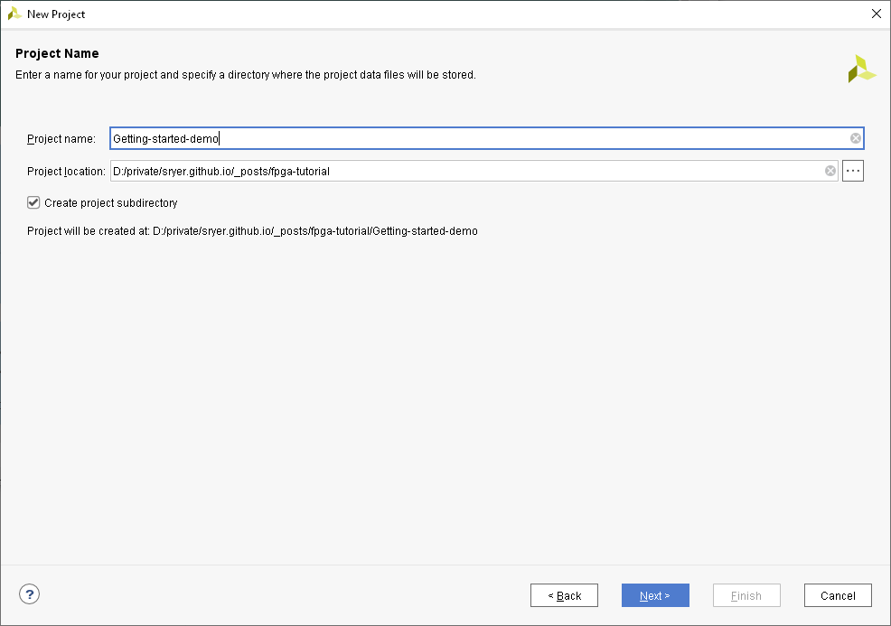
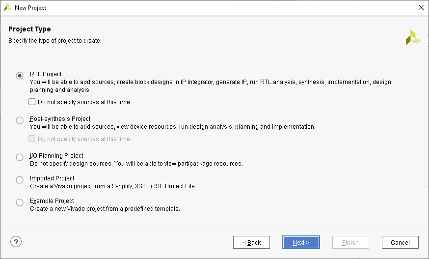
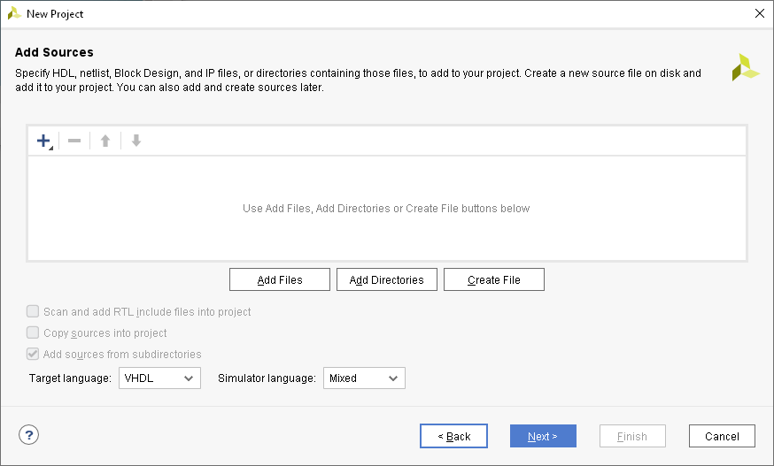
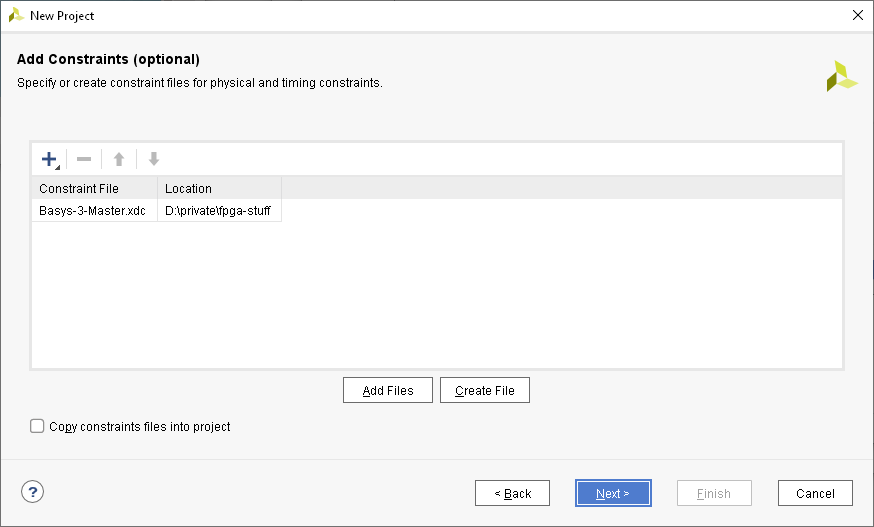
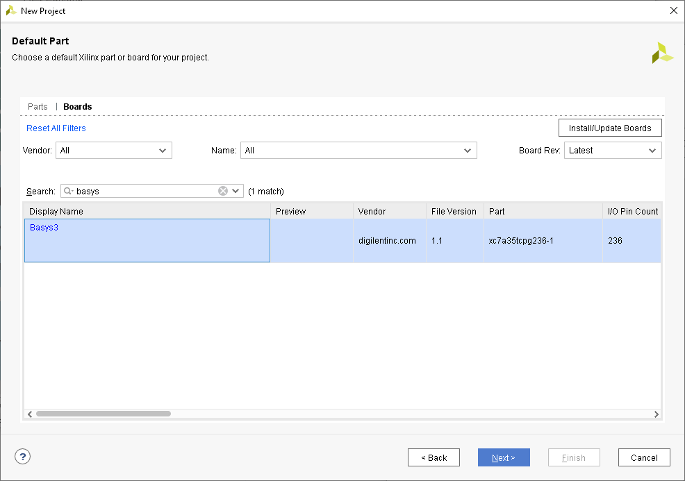
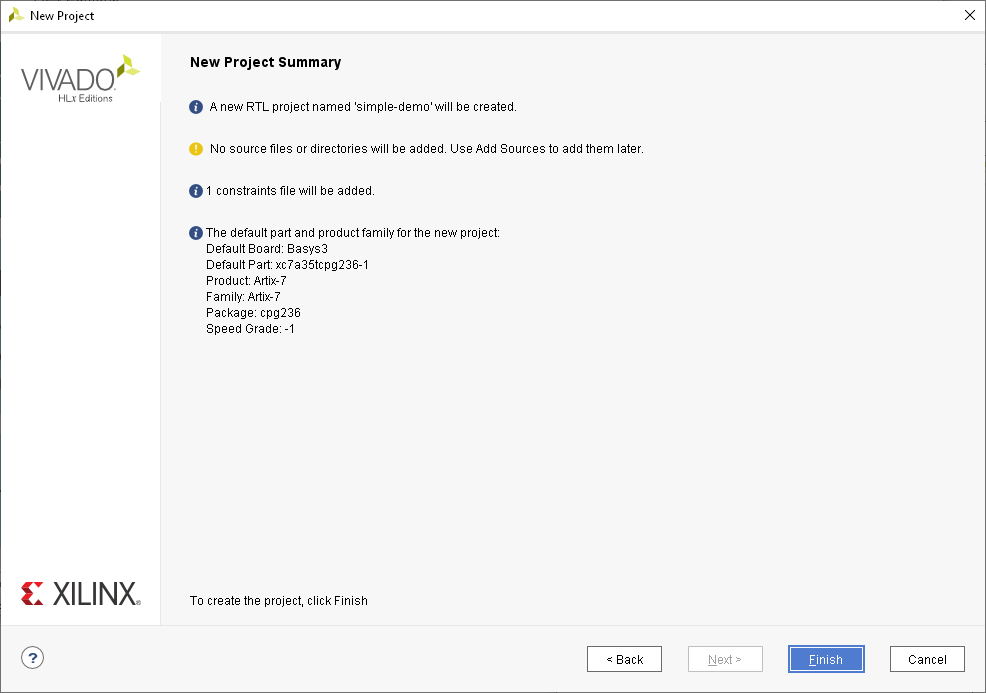

Installation:

- Install vivado webpack edition (allows for development for basys3 board)

- Download extra stuff from digilent page. Link:  [Xilinx downloads page](https://reference.digilentinc.com/reference/programmable-logic/basys-3/start?redirect=1)

  - Download xdc-file to be included in new projects: [Basys-3-Master.xdc](https://github.com/Digilent/digilent-xdc/blob/master/Basys-3-Master.xdc)
  - Install board-files, including the basys3-board, by following this link: [Installing Vivado, Xilinx SDK, and Digilent Board Files](https://reference.digilentinc.com/vivado/installing-vivado/start)

- Downlaod basys3 constraints-file (contains mapping-info from logical names to pin-numbers) which will be a .xdc-file.

  Link: , Direct download link: 

- Create new project.

  - In the following example I am creating a demo project for this blog post case	
  - Choose RTL Project
    
  - Skip "add sources" step
    
  - Add constraints-file. NOTE: Remember to flag "Copy constraints files into project".
  - 
  - In the next section, switch to the "boards" pane, and search for basys3:
    
  - Now click "Finish":
    

