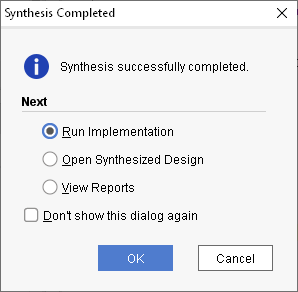

In this tutorial, I will go through how to create the simplest possible project and deploy it to the basys 3 board.


Prerequisites: A clean, new project (follow my previous tutorial for details)


On the Basys3 board there are 16 switches in a row and 16 corresponding leds.

When you first turn on your basys3 board, a predeployed demo is started and will allow you to toggle any switch and the led right next to the switch will also togle its lightning.

In order to be able to distinguish this simple demo logic from the preflashed logic described aboved, I have decided, that my simple project should implement a reversed-order-switch, meaning that when turning on switch 0, led 15 should be turned on. When turning switch 1, led 14 should be turned on, etc.

This way it is possible to verify, that your own code is actually executed on the fpga and not the preflashed demo code.

When you have a clean project, the first step is to edit the xdc-file. This file maps all the mumbo-jumbo names in the basys3 board to pretty, easily readable and nicely structured variable names. When opening the file, this is what you'll see:


In our example we will need all the switches, all the leds lights and a clock signal. To get this, we will have the remove the comment-sign "#" from these lines:


The next step is to create a new vhdl-file by clicking the plus sign shown here:


Choose "Add or create design sources":


Now click "Create":


Pick "VHDL" in the dropdown and type in a name for the file. I choose "ReverseLedBlinker":


The next step now is "Define module". This is a UI which helps you initialize the input and output parameters for the module. Everything you do here, you can correct afterwards. This is just a help and if you don't type anything and just click "OK", you can add all the parameters afterwards. I choose to use this UI and now I need to match the variable names which I added (by removing the comment signs) in the xdc-file. Those are "led" (output led-lights as an array with 16 slots), "sw" (input switches as an array of 16 slots as well) and "clk" which is the input clock signal. Don't think too much about the clk-signal, it is just a necessary heart beat for the whole module to do its magic. Type in the three parameters like this:


"sw" and "led" are checked as "bus" meaning they are arrays and are defined as MSB (Most significant byte) set to 15, and LSB (Least significant byte) set to 0. Hit "OK" and Vivado will generate the following module for you:


I will now remove all the comments in the generated file to make it slimmer, and add two comments myself, pointing out where local variables and module logic should be:

```
library IEEE;
use IEEE.STD_LOGIC_1164.ALL;

entity ReverseLedModule is
    Port ( clk : in STD_LOGIC;
           sw : in STD_LOGIC_VECTOR (15 downto 0);
           led : out STD_LOGIC_VECTOR (15 downto 0));
end ReverseLedModule;

architecture Behavioral of ReverseLedModule is

begin

process(clk) is

-- Local variable collection goes here

begin

-- Module logic goes here

end process;


end Behavioral;
```

Now I add the reverse-logic where the state of the first led, led(0), should be set to the state of last switch, sw(15) and so on. In the first example I will copy/paste the code till I have 16 lines of identical logic, only varying on the indexes of sq and led. (Later I will show the same logic using a loop).

```
library IEEE;
use IEEE.STD_LOGIC_1164.ALL;

entity ReverseLedModule is
    Port ( clk : in STD_LOGIC;
           sw : in STD_LOGIC_VECTOR (15 downto 0);
           led : out STD_LOGIC_VECTOR (15 downto 0));
end ReverseLedModule;

architecture Behavioral of ReverseLedModule is
begin
    process(clk) is
    -- Local variable collection goes here
    begin
        -- Module logic goes here
        led(15) <= sw(0);
        led(14) <= sw(1);
        led(13) <= sw(2);
        led(12) <= sw(3);
        led(11) <= sw(4);
        led(10) <= sw(5);
        led(9) <= sw(6);
        led(8) <= sw(7);
        led(7) <= sw(8);
        led(6) <= sw(9);
        led(5) <= sw(10);
        led(4) <= sw(11);
        led(3) <= sw(12);
        led(2) <= sw(13);
        led(1) <= sw(14);
        led(0) <= sw(15);
    
    end process;
end Behavioral;
```

This is all it take to implement the desired logic for this demo.

# Deploying

Every time you need some code, new or update, deployed to the fpga, there are the following steps that must be executed:

1. Run synthesis. This step converts the VHDL code to logic circuits in a general manner.
2. Run implementation. This step converts the logic circuit result from the synthesis and decides how this should be implemented to fit that target board, in this case, that Basys 3 board.
3. Generate Bitstream. This step converts the output from the implementation into the final bits that should be sent to the fpga and that the fpga is able to load and run.
4. Send the bitstream to the board

These steps are time consuming so have patience. This is very different from compiling C#, Java, C etc. code.

## Step 1: Synthesis

First, you click the "Run synthesis" to your left hand side:


Just hit "OK" at the next window:


The synthesis-job is now running and you can follow it's progress in the "Design runs" tab at the bottom.


On my laptop, this step alone took 44 seconds.

## Step 2: Implementation

When the synthesis step finishes, a prompt is shown where you can choose to carry on running the implementation step now. Just click "ok" here.



In the next window, just click "Ok" once again:


 If you click cancel, you can always run the implementation step by clicking "Run implementation" on the left hand side. The implementation step is now running and the progress is visible at the bottom just like the synthesis step was:


The implementation step took 56 seconds on my laptop.

## Step 3: Generating bitstream

When the job finishes, you are shown another prompt allowing you to continue with the next natural step; the generation of the bitstream. Select "Generate bistream" in the radio button list and Click "Ok":


## Step 4: Deploy

After running the bitstream generation yet another prompt is shown. Just click cancel in this one.

Now connect the Basys3 board with your PC with a usb-cable. Then Click "Open Target" => "Auto Connect":


This will make Vivado connect to the board. Afterwards the "Program device" is no longer disabled. Click this and pick the only option in the dropdown menu:


This will make Vivado ask for a bitstream file to deploy to the board. The previously generated bitstream file will be preselected, so just click "Program" here:


A few seconds later, the basys3 board should stop showing its preflashed demo and now you can turn on the switches and verify, that the corresponding led light (in reverse order) will now be toggled.